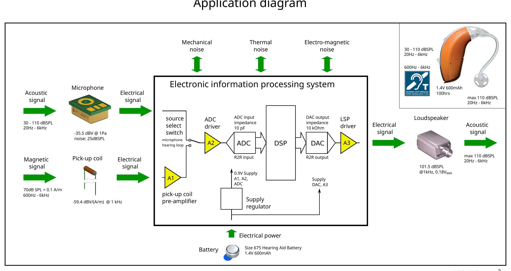
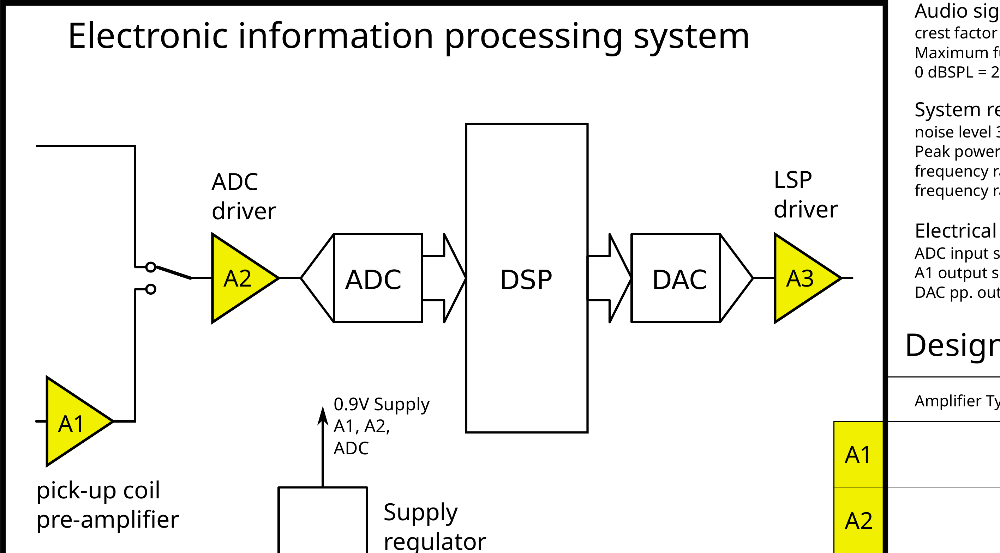
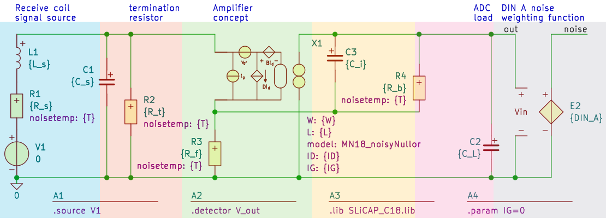
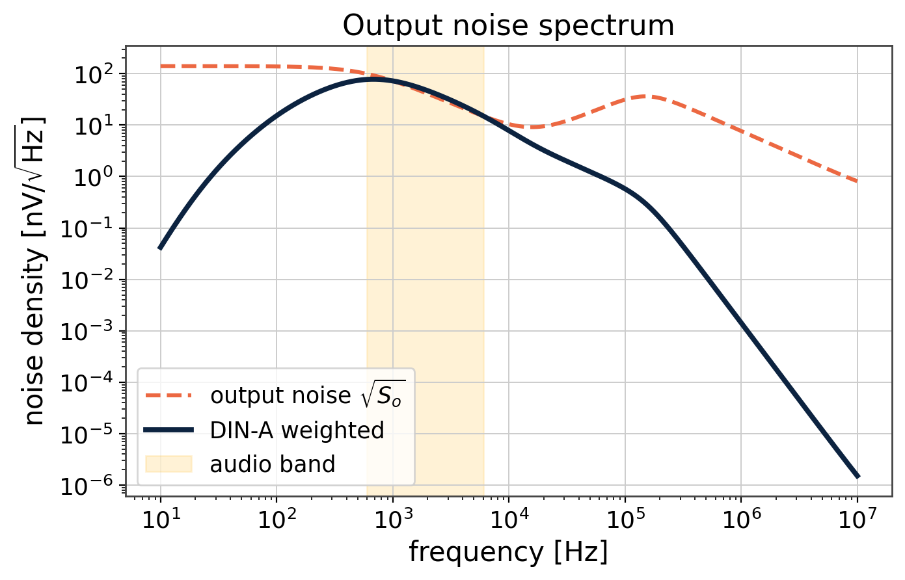
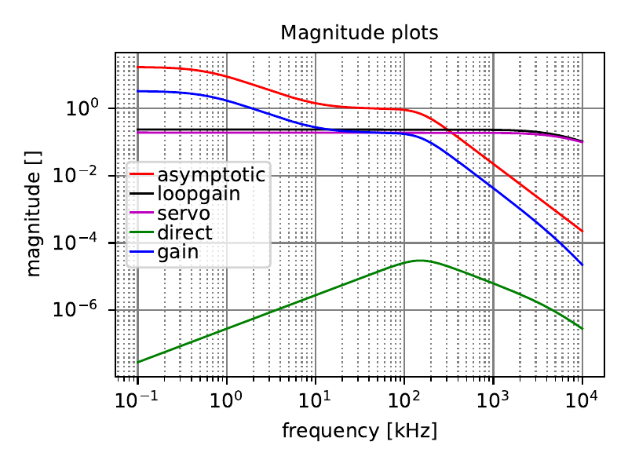
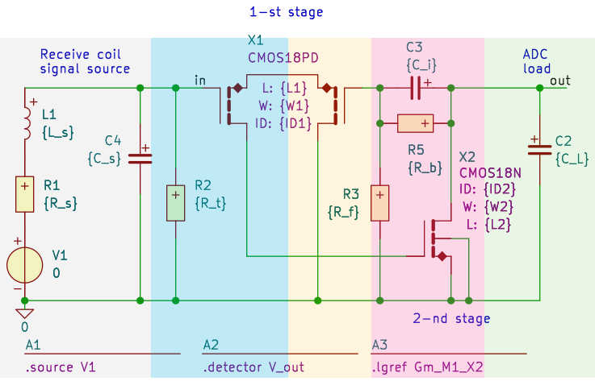
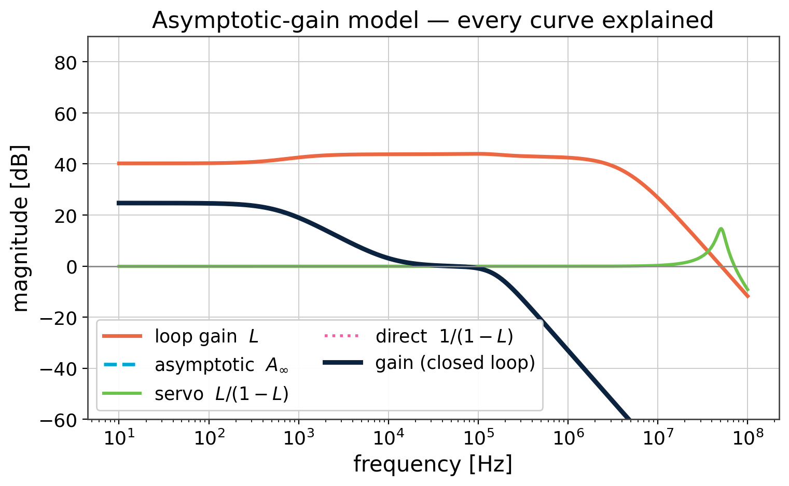
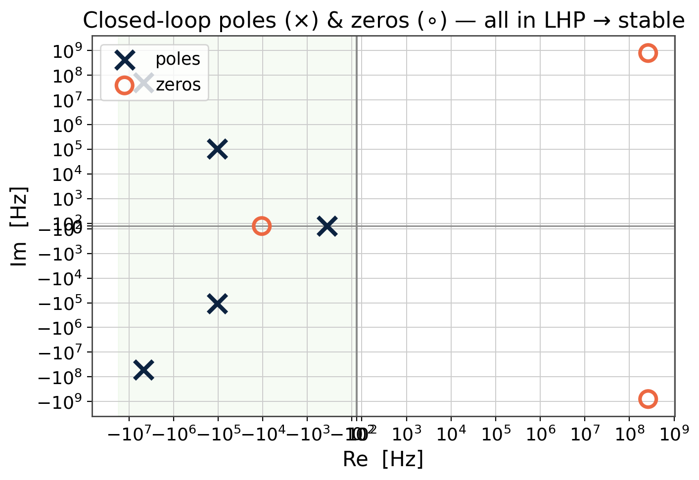
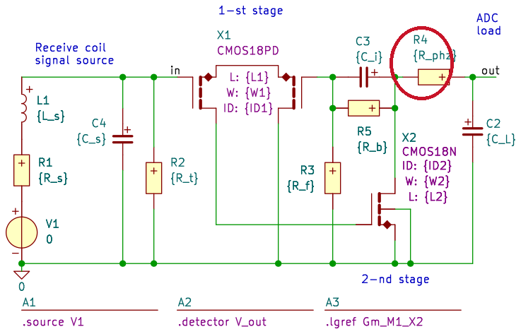
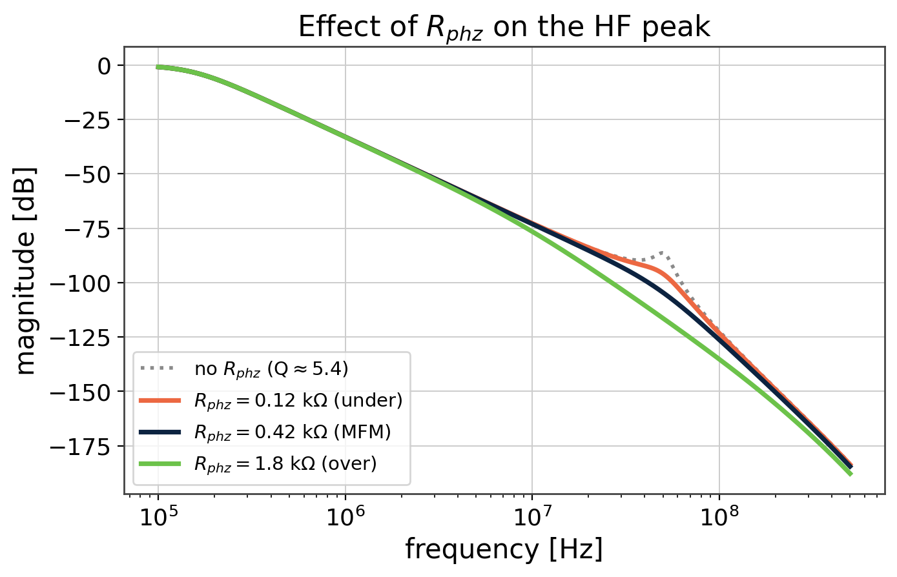

<div align="center">


# Structured Electronic Design — Hearing-Loop Receiver (A1)

**A top-down, fully reasoned analog IC design of the A1 receive-coil amplifier**
for a hearing-aid loop receiver — taken from specification to a frequency-compensated,
stability-verified two-stage CMOS amplifier.

TU Delft **EE4109 — Structured Electronic Design** · 180 nm CMOS · single 0.9 V supply

`SLiCAP (symbolic)` · `ngspice` · `LTspice` · `KiCad` · `Python / Jupyter`

</div>

---

## What this is

A **hearing loop** is a wire run around a room that broadcasts audio as a magnetic field; a
hearing aid picks it up with a small coil. **A1 is the first amplifier after that coil** — it
turns the coil's magnetic pickup into a clean audio voltage for the ADC that follows.

<div align="center">

</div>

The interesting part isn't the final schematic — it's **how the design is reached**. This repo
follows the *structured electronic design* method: every component and every curve is justified,
**options are generated before choices are made**, and the work proceeds in a fixed order —
**specification → transfer → noise → stages → poles/zeros → compensation**. The symbolic tool
([SLiCAP](https://www.analog-electronics.tudelft.nl/SLiCAP/)) enforces that order, and every
symbolic result is verified numerically in ngspice/LTspice.

---

## Headline results

| Quantity | Result | Why it matters |
|---|---|---|
| Transfer | `H(s) = 62.4×10³ / s`  (τᵢ = 16.06 µs) | An **integrator** — cancels the coil's intrinsic differentiation so the band stays flat |
| Audio band | 600 Hz – 6 kHz | Hearing-loop standard passband |
| Output noise | ≈ 7.5 µV RMS  (budget ≤ 10.6 µV, DIN-A weighted) | Sits **below the microphone noise floor** (30 dB SPL) |
| Loop gain | ≈ 45 dB (DC) | Enough feedback that the passive network — not the transistor — sets the gain |
| Stability | 5 poles, **all in the LHP** | Verified by pole-zero analysis on the EKV transistor model |
| Compensation | one resistor `R_phz ≈ 0.42 kΩ` | A **phantom zero** pulls a high-Q pole pair from Q ≈ 5.4 → 0.70 (maximally flat) |

**The design problem in one line:** A1 is a **voltage-to-voltage integrator** driving a 10 pF ADC
input on a 1 mW budget, whose weighted output noise must stay below the microphone floor.

---

## The design story

The repository is organised as a design *argument*. Each step below corresponds to notebooks in
[`Notebooks/`](Notebooks/README.md) and slides in the [exam-review deck](SED_Exam_Review_Daniel_Tyukov/).

### 1 · Specification — start from the environment

Before any transistor: what feeds A1 and what it drives. The coil output ∝ dΦ/dt (it
**differentiates**), so A1 must **integrate** to stay flat. The ADC draws no current, so the only
load is a 10 pF cap. Those two facts fix the topology and the transfer.

<div align="center">

</div>

### 2 · Build the model block by block

The amplifier is first an ideal **noisy nullor** (not yet a transistor). The full concept circuit
is colour-coded by function: coil + parasitics, termination resistor `R_t` (critically damps the
150 kHz coil resonance), the feedback network that sets the transfer, the ADC load, and the
DIN-A noise-weighting block.

<div align="center">

</div>

### 3 · Noise design drives the first stage

The 30 dB SPL floor maps to a **≈ 10.6 µV weighted output-noise budget**. Each resistor adds
thermal noise (4kTR); the input device adds its own v̄ₙ and i̅ₙ. Budgeting the source, termination,
and feedback resistors at 40% of the budget leaves the rest for the input transistor — which fixes
its required transconductance gₘ. Noise is weighted with the **DIN-A** curve because it is judged
by ear.

<div align="center">

</div>

### 4 · Is one stage enough? — generate the option, then test it

The simplest realisation is a single common-source transconductor. But its **loop gain stays
below 0 dB** across the band (black curve) — so feedback can't enforce the transfer and accuracy
suffers. One stage **fails on accuracy**, which justifies adding a second.

<div align="center">

</div>

### 5 · Dual stage — split the job

Key insight: the **first stage dominates the noise**, the **second stage dominates the loop gain**.
So the input is a low-noise **PMOS differential pair** (also a natural match for the floating coil),
followed by a high-gain **NMOS common-source** output. Together they reach ≈ 45 dB of loop gain.

<div align="center">

</div>

The asymptotic-gain model decomposes the response into **every curve that matters** — closed-loop
gain, asymptotic (ideal) gain, loop gain, servo, and direct feed-through. The gain follows the
ideal target exactly where the servo function holds at 1.

<div align="center">

</div>

### 6 · Pole-zero analysis on the realistic (EKV) model

Swapping ideal devices for the **EKV small-signal model** brings in finite output conductance and
parasitic capacitances — and with them the high-frequency poles/zeros. All five poles land in the
**left half-plane (stable)**, but one pair near 51 MHz has **Q ≈ 5.4** → it peaks.

<div align="center">

</div>

### 7 · Compensation — one resistor, the phantom-zero method

Because the feedback is tapped *before* `R_phz`, adding this single resistor injects a **zero into
the loop gain** without putting a real pole in the signal path — no compensation capacitor, no
extra signal-path noise. It pulls the high-Q pair to **Q ≈ 0.70** (maximally-flat / Butterworth).

<div align="center">

&nbsp;&nbsp;

</div>

Sweeping `R_phz` shows the trade-off directly: too small under-damps (the bump survives), the MFM
value flattens it, too large over-damps and costs bandwidth. **The entire fix is one resistor** —
the structured-design payoff.

---

## Toolchain

This project pairs **symbolic** and **numeric** analysis — the methodological point of the course.

| Tool | Role |
|---|---|
| **[SLiCAP](https://www.analog-electronics.tudelft.nl/SLiCAP/)** 4.0.10 | Symbolic small-signal analysis — transfer, poles/zeros, noise, DC. *Returns equations.* |
| **ngspice** 42 | Native numeric simulation, sweeps, fast iteration. *Returns numbers.* |
| **LTspice** XVII | Verification of existing `.asc` coursework |
| **KiCad** 9 | Schematic capture (exported into the SLiCAP flow) |
| **Python 3.12 / Jupyter** | The design pipeline — 8 chained notebooks |

> **SLiCAP returns equations; ngspice/LTspice return numbers — every symbolic result is verified numerically.**

---

## Repository structure

```
tud-structured-electronic-design/
├─ Notebooks/                    ← the live 8-step A1 design pipeline (start here)
├─ EE4109-2025-2026/             ← course reference: 14 lectures, specs, worked examples
├─ SED_Exam_Review_Daniel_Tyukov/← self-contained ~1 h design-review deck (Beamer + assets)
├─ SLiCAPexamples/               ← upstream SLiCAP examples (API reference)
├─ SLiCAP_book/                  ← "Structured Electronics Design" textbook sources
├─ tools/run_hlr_notebooks.py    ← batch runner for the 8 notebooks
├─ AGENTS.md                     ← repository map / orientation
└─ SETUP.md                      ← environment + notebook run order
```

For a deeper map see **[`AGENTS.md`](AGENTS.md)**; for the pipeline data-flow see
**[`Notebooks/README.md`](Notebooks/README.md)**.

### The design pipeline (`Notebooks/`)

Eight notebooks form a chain — each reads CSV artifacts written by the previous ones:

```
specifications ─▶ feedbackConfig ─▶ firstStageDesign ─▶ singleStage ─▶ dualStage ─▶ dualStageFrequencyCompensation
                                          (DIN_A weighting filter feeds the noise analysis)
```

| # | Notebook | Purpose |
|---|---|---|
| 1 | `specifications.ipynb` | Functional model + specifications |
| 2 | `feedbackConfig.ipynb` | Feedback network (transfer, noise, power) |
| 3 | `feedbackConfigSimple.ipynb` | Simplified feedback design |
| 4 | `firstStageDesign.ipynb` | CS input stage from the noise budget |
| 5 | `DIN_A.ipynb` | DIN-A weighting filter (ngspice subcircuit) |
| 6 | `singleStage.ipynb` | Single-stage amplifier (loop-gain check) |
| 7 | `dualStage.ipynb` | Dual-stage amplifier (PMOS pair + NMOS CS) |
| 8 | `dualStageFrequencyCompensation.ipynb` | Phantom-zero compensation |

---

## Run it

Full environment and run order are in **[`SETUP.md`](SETUP.md)**. In short:

```bash
# install (Python 3.12+)
pip install SLiCAP==4.0.10 jupyter
# + ngspice 42 and KiCad 9 from your package manager

# interactive — study each notebook in order
cd Notebooks
jupyter notebook            # Run-All each notebook 1→8, answering the input() prompts

# non-interactive — run all 8 in order (auto-answers the prompts)
python tools/run_hlr_notebooks.py
```

Outputs land under `Notebooks/`: design data (`csv/`), schematic & plot SVGs (`img/`), and HTML
reports (`html/`). Last verified end-to-end run: all 8 notebooks pass (see `SETUP.md`).

---

## The design-review deck

[`SED_Exam_Review_Daniel_Tyukov/`](SED_Exam_Review_Daniel_Tyukov/) is a self-contained ~1-hour
design review of A1 — a 46-slide Beamer deck (TU Delft theme) where every figure is regenerated
from SLiCAP and every number is verified against the design data. It is the source of the figures
in this README.

---

<div align="center">

**Daniel Tyukov** · TU Delft MSc · EE4109 Structured Electronic Design
[Course website](https://analog-electronics.tudelft.nl/EE4109-2025-2026/courseWebSite/index.html)

</div>
